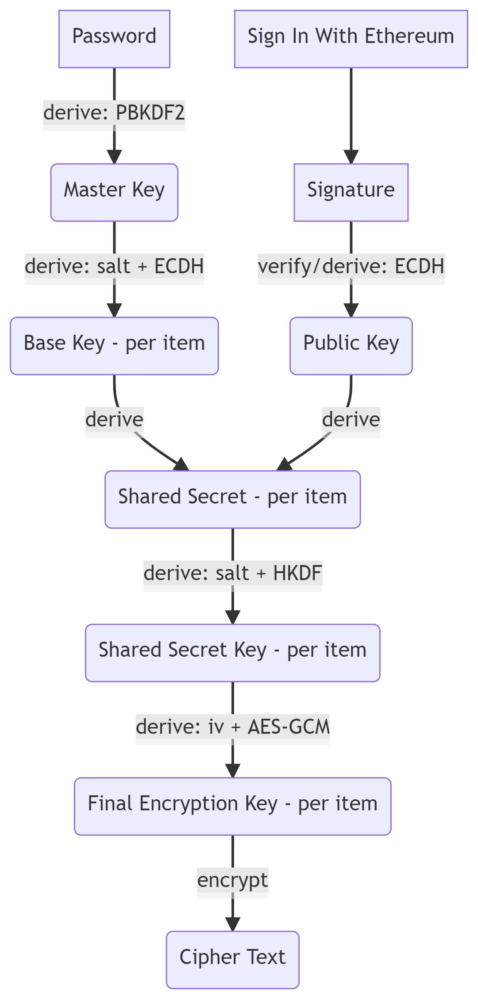
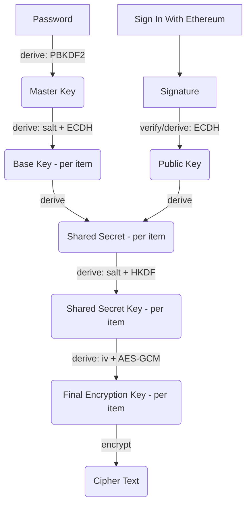

# Freehold

>  /ˈfrēˌhōld/
>  
> _noun_
>  
>  : permanent and absolute tenure of land or property with freedom to dispose of it at will.

Freehold is a library to help users gain freehold of their data, using in-browser cryptography coupled with the power of popular crypto wallets. 

### Install

```
$ npm install --save-dev freehold
```

### Usage

Freehold can be used in both the browser as well as Node. For this usage example, we'll assume a typscript/ES6 integration with the proper preprocessing (which can apply to both):
 
```typescript
// Assume provider and signer are properly initialized per ethers documentation
let provider:ethers.providers.JsonRpcProvider = /* ... */; 
let signer:ethers.providers.JsonRpcSigner = /* ... */;

// Address that will respond to personal_sign requests
let address = signer.getAddress();

// Define the user-provided data to be signed by the crypto wallet.
// Two types are available: "password" and "message", and are handled
// differently. See below. 
let params:SignatureFragment = {
  type: "password",
  data: "r3a11y5tr0ngpa55w0rd!!!" // user provided
};

// Create a freehold signing object. This will cause the crypto
// wallet to sign the signature fragment(s) via a personal_sign request.
// The params object can be an array of signature fragments.
// Each fragment will trigger a new personal_sign request.
let freeholdSigner = await freehold(
  provider,
  address, 
  params
);

// To encrypt a message:
let message = "I've got a secret...";
let ciphertext = freeholdSigner.encrypt(message)
// => "uzhmDmK5NKaZ-yQvSmhrHJw3rcfvPblE-sKsNZiK10-9L72NZzARrRBAp6L60hSA"

// To decrypt:
let decryptedMessage = freeholdSigner.decrypt(ciphertext);
// => "I've got a secret...".
  
```

### Encryption Scheme

Freehold uses many steps to provide (likely more than) adequate security during encryption and decryption. You can see these steps in the diagram and list below.



On initialization:

1. Accept a password from user (via the calling application) and derive a PBKDF2 master key ("Master Key"). 
2. Trigger Sign-on With Ethereum, requesting the user to sign a message with their Ethereum wallet. 
3. Verify the signature came from the expected wallet address, and then use the signature to derive the address's ECDH public key ("Public Key")

During encryption of each item: 

4. Generate a random salt using secure, browser-based random number generation ("PBKDF2 salt"), and run that through the PBKDF2 algorithm, using the Master Key as a base, to create a ECDH private key ("Base Key").
5. Derive the ECDH shared secret between the Base Key and the Public Key ("Shared Secret").
6. Generate another random salt ("HKDF salt") and feed that along with the Shared Secret into the HKDF algorithm, to create the "Shared Secret Key". 
7. Generate a random initialization vector ("iv"), and use that iv along with the Shared Secret Key to create a final AES-GCM key that will be used for encryption. 
8. Finally, perform the encryption, and output a base64-url encoded string that contains the iv + PBKDF2 salt + HKDF salt + raw cipher text. This output can then be fed back into the same Freehold Signer for decryption. 

### Rationale / FAQ

More encryption doesn't necessarily mean better encryption. In fact, it could hinder security if any step is used improperly. The following is a general rationale for the scheme, as well as description of some specific steps. 

#### Why require a password when a wallet signature will do? 

The goal of Freehold is to empower the user, and give them control of their data. Although it is technically possible to use a deterministically-derived wallet signature as input into the PBKDF2 algorithm (and thus, the whole scheme) doing so would require the user to completely trust their wallet as well as trust every step along the signature-generation supply chain (think: libraries, services, network providers, etc.). The signature, in that case, would be the seed from which everything else is derived, and thus would be too powerful and open to attack. The only solution for this is to provide input into the key derivation scheme that only the user knows. 

#### Don't wallets already have a password (e.g., Metamask)? Isn't that enough? 

No. In the age of custodial, internet-enabled wallets (and non-technical users who can't tell the difference), who knows how many services or network hops are required to produce a signature. You can't trust 'em all, so why even try? 

Moreover, wallet signatures are not meant to be kept secret. They're just that -- signatures -- and are meant solely to verify the authenticity of a message. Wallet providers cannot be expected to handle signatures in a privacy-protected way, which means they might be sent over the wire in plaintext, be recorded in application or service-level logging, or passed to the application unencrypted. 

Simply put: We can't trust the wallet to handle signatures correctly, so we need a second factor in the encryption scheme, which is the password. 

#### Okay then. If signatures are just signatures, why use a signature at all? 

As mentioned above, we need a second factor in the encryption scheme. Passwords are susceptible to phishing and being discovered maliciously if they're not strong enough. If the password were the only factor, then data would inevitably get stolen.

That said, the signature itself is not the second factor. We initially use the wallet signature as a way of validating that the user is in control of a specific account. From there, we use the signature along with the properties of Ethereum's (and Bitcoin's) preferred encryption algorithm (namely, ECDH) to derive a shared secret key between the key generated by the user's password, and the wallet's underlying public key. This shared secret key is what's ultimately used for encryption, and ensures that data from both the user and the wallet are materially used in the encryption process.  

#### Why Sign In With Ethereum?

Two reasons: 1) It's cool. 2) We need the user to sign an ever-changing message.

This is similar to the reasoning above, in that we can't assume trust in the wallet. In this case, we're primarily preventing against more malicious attacks, where a wallet creator or employee is able to acquire a wallet-produced signature (e.g., through logs, unencrypted network transfer, etc.). If the application required the user to sign the same message every time, theoretically someone in that supply chain could get their (filthy) hands on it. By requiring the wallet to sign a different message each time, we ensure no information can be gained. 

#### Why do you use PBKDF2 on the password? Why create create a base key per-item? 

PBKDF2 ensures that if an attacker is going to brute force the password, they're at least going to spend a hefty amount of computing resources doing it. PBKDF2 keys are easy to verify but hard to brute force, so we ensure attackers will be deterred from doing so. 

Adding a salt into the PBKDF2 algorithm on every encryption protects against rainbow table attacks and other key derivation strategies attackers might use if they get their hands on a piece of encrypted data. Adding a salt and creating a new key per-item also ensures that if 


### Possible attacks

Freehold helps app developers secure their user's data (even from themselves!), but freehold can't help with all types of attacks. Here's a non-exhaustive list of attack types and how freehold can help:

* Malicious access to password, or password leaked through external means and used to decrypt sensitive data
  * ✔️ Protected: Signatures from the crypto wallet are used in key generation, and the deterministic signing key cannot be created by the password alone. An attacker would also need access to the crypto wallet in order to decrypt sensitive data, and when used with a hardware wallet, this would require physical access. If freehold is used properly (where the password is used to decrypt data locally for the user), the password would never need to be stored by the service provider and therefore wouldn't be a part of Big Co. data breaches.
* Malicious wallet application, or MiM attack during production of wallet signatures in order to decrypt sensitive data
  * ✔️ Protected: The user's password is part of key generation, and the deterministic signing key cannot be created by the wallet signature(s) alone. An attacker would also need access to the password to decrypt sensitive data. Note that the plaintext password is never sent to the wallet. Instead, it is hashed and then quickly disposed of before being used in the key generation and signing process.
* Key derivation through malicious access and analysis of encrypted data (e.g., rainbow table attacks, brute forcing, quirks of encryption schemes, etc.):
  * ✔️ Protected: Freehold uses two types of encryption to encrypt users' data. First, a master key is created using PBKDF2 from a mixture of both the user's password as well as signature fragments from the crypto wallet. Then, for each encryption request, Freehold runs a random salt through 100k PBKDF2 iterations (the same amount as 1Password) to create a seed for the next encryption step. Finally, Freehold uses 256-bit AES-GCM encryption with a random 96-bit initialization value to encrypt the data (if you're a crypto nut, this all means something). Together, this dual ecryption scheme protects against brute-force attacks by requiring attackers to run computationally-expensive PBKDF2 iterations on every brute-force attempt, which they'd be silly to do. And by using the salted PBKDF2 result as a seed into the AES-GCM encryption algorithm, we gain all the security benefits of AES-GCM encryption while completely bypassing its rough edges (which are, specifically, that using the same key and same IV more than once during encryption could allow attackers to uncover the secret key through careful analysis). Here we ensure every encryption request has a completely unique key (e.g., PBKDF2 + random salt + AES == key), that will never overlap with any other. And even if the key for a specific piece of data is discovered, only that piece of data is at risk, rather than the whole data set. Additionally, all encryption algorithms mentioned are supplied natively by the browser, rather than provided by Freehold, which maintains the trust assumptions users already possess. 
* Supply chain attack on application source code, maliciously altering code to A) transmit cleartext data to a third party (or the application author) after it's decrypted; B) spoof wallet interactions; C) do anything malicious.
  * ❌ Not protected: The application needs to be trusted, as ultimately the application is managing the encryption and decryption process (and the protection of encrypted data vs. cleartext data). These risks can be mitigated by open-sourcing frontend code, conducting security audits, implementing [Hardened Javascript](https://agoric.com/wp-content/uploads/2021/10/Hardened-JavaScript.pdf), and placing audited and trusted frontend code in content-addressable storage like [IPFS](https://ipfs.io/) so you know it's not tampered with. 

### MISC 

The above diagram was created using Mermaid.js, and the following code within the [live editor](https://mermaid.live/edit/#eyJjb2RlIjoiZ3JhcGggVERcbiAgICBQQVNTW1Bhc3N3b3JkXSAtLT58ZGVyaXZlOiBQQktERjJ8IE1BU1RFUihNYXN0ZXIgS2V5KVxuICAgIFNJV0VbU2lnbiBJbiBXaXRoIEV0aGVyZXVtXSAtLT4gU0lHXG4gICAgU0lHW1NpZ25hdHVyZV0gLS0-fHZlcmlmeS9kZXJpdmU6IEVDREh8IFBVQihQdWJsaWMgS2V5KVxuICAgIE1BU1RFUiAtLT58ZGVyaXZlOiBzYWx0ICsgRUNESHwgSVRFTUJBU0UoQmFzZSBLZXkgLSBwZXIgaXRlbSkgXG4gICAgSVRFTUJBU0UgLS0-fGRlcml2ZXwgU0hBUkVEQklUU1xuICAgIFBVQiAtLT58ZGVyaXZlfCBTSEFSRURCSVRTKFNoYXJlZCBTZWNyZXQgLSBwZXIgaXRlbSlcbiAgICBTSEFSRURCSVRTIC0tPnxkZXJpdmU6IHNhbHQgKyBIS0RGfCBTSEFSRURLRVkoU2hhcmVkIFNlY3JldCBLZXkgLSBwZXIgaXRlbSlcbiAgICBTSEFSRURLRVkgLS0-fGRlcml2ZTogaXYgKyBBRVMtR0NNfCBBRVMoRmluYWwgRW5jcnlwdGlvbiBLZXkgLSBwZXIgaXRlbSlcbiAgICBBRVMgLS0-fGVuY3J5cHR8IENJUEhFUihDaXBoZXIgVGV4dClcblxuXG4gICIsIm1lcm1haWQiOiJ7XG4gIFwidGhlbWVcIjogXCJkYXJrXCJcbn0iLCJ1cGRhdGVFZGl0b3IiOnRydWUsImF1dG9TeW5jIjp0cnVlLCJ1cGRhdGVEaWFncmFtIjp0cnVlfQ): 

